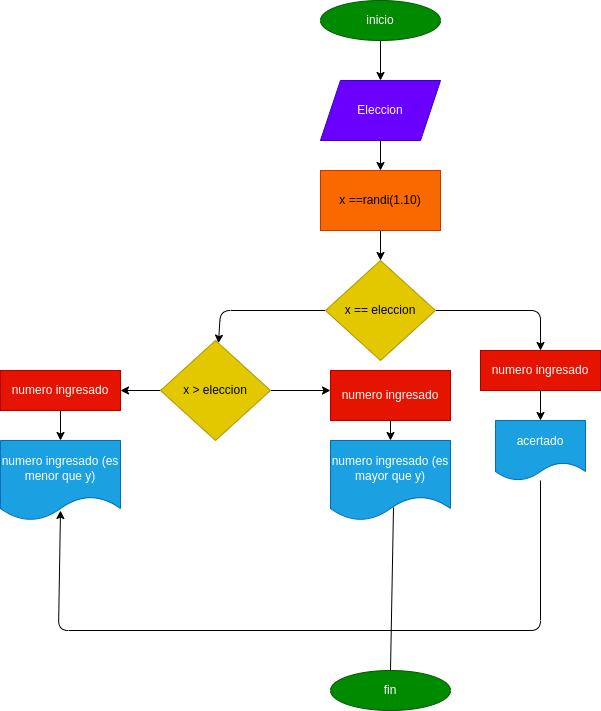

# Adivina_el_numero

## Programa para adivinar un numero aleatorio

# Analisis

variable de entrada (imput)

X: numero para adivinar 

variable del proceso y salida (prosessing, storange, output)

r=resultado de la verificacion numero es mayor o menor 

# DISEÑO

# CONSTRUCCION
